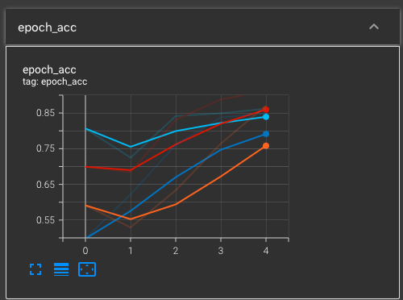

# Sentimen Analysis Prediction on IMDB review
 

 
 
 
 
 
 

# Project Description 

# How to Install and Run the Project 
Click on this provided link, you will be redirected to Google Colab, https://colab.research.google.com/drive/1YfsfFq1Uw1im1zKxWRV9zp41pbSWdkpv?usp=sharing, 
you may need to sign in to your Google account to access it. You may need to download models from the depository section and re-upload it in a folder, rename that folder to models inorder to run and test it. 

Alternatively, if you wish to run the model on your pc, you may download NLP_training.py and deploy.py file from the depository section. The sample datasets and model has already been included in the depository section. 

For pc user: 
Software required: Spyder, Python(preferably the latest version) 
Modules needed: Tensorflow, Sklearn 

## Credits
This is heading level 

<h2>You can use HTML</h2>

**I am bold**

>The way, the truth, the life. 
>import numpy as np 
>np.expand_dims(wealth, axis=-1)

### code block 

`import numpy as np`

`np.expand_dims(wealth, axis=-1)`

